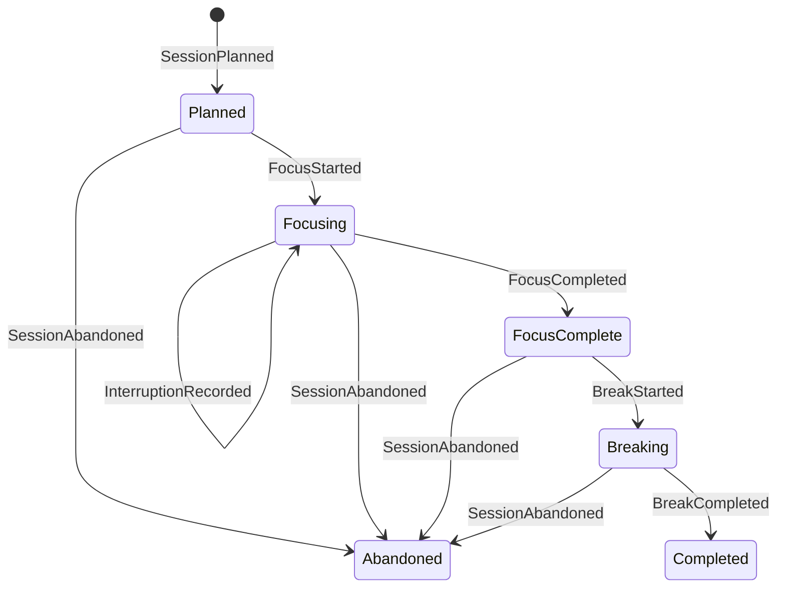

# GWorker

GWorker is becoming a local-first engine for adaptive focus experiments. Instead
of treating a timer as the product, it models each work block as an auditable
sequence of domain events that can later be replayed, evaluated, and used by a
privacy-preserving recommendation policy.

> **Development status:** the event-sourced domain foundation is implemented.
> Durable storage, the adaptive policy, counterfactual evaluation, the CLI, and
> reproducible visual evidence are the next incremental milestones. This README
> deliberately does not claim that those pieces exist yet.

## Why an event log?

A conventional timer remembers only the current countdown. That makes crash
recovery, debugging, and honest policy evaluation difficult. GWorker instead
reduces immutable events into state:



The reducer rejects gaps, out-of-order timestamps, cross-session events, and
invalid transitions. A future policy can therefore learn from an explicit
outcome history instead of silently inferring success from a countdown reaching
zero.

## Current scope

- Immutable, typed events for planning, focus, interruptions, breaks, and
  abandonment.
- A pure reducer with strict revision and transition checks.
- A small state projection with measured focus and interruption totals.
- Standard-library tests; the runtime currently has no third-party
  dependencies.

Run the foundation checks:

```bash
PYTHONPATH=src python3 -m unittest discover -s tests -v
PYTHONPATH=src python3 -m compileall -q src tests
```

## Design boundaries

GWorker is intended for personal self-experimentation, not employee monitoring.
It stores no name, account, device fingerprint, or telemetry. Objectives may be
sensitive, so future journals will be local by default and ignored by Git.
Synthetic fixtures—not a developer's real work history—will power committed
demos and screenshots.

The adaptive milestone will recommend a work-block duration and expose the
evidence behind that choice. It will not assign a universal “productivity
score,” diagnose health conditions, or claim causal effects from observational
data.

## Rehabilitation note

The repository's single 2023 commit is preserved as historical context. That
upload contained a broken Pomodoro prototype with import-time file writes,
undeclared audio dependencies, and plaintext name storage. The implementation
on this branch is a clean-room replacement and does not import or package the
legacy modules.

No license has been added. Repository control does not by itself establish the
rights needed to license the historical upload, so licensing remains an explicit
release decision for Omar.

## Roadmap

1. Transactional SQLite event journal with deterministic replay and recovery.
2. Deterministic CLI simulation and crash-recovery workflow.
3. Contextual duration policy with logged action probabilities.
4. Offline replay evaluation with uncertainty and baseline comparisons.
5. Reproducible CLI captures, architecture diagrams, result plots, and a short
   terminal demo generated from synthetic data.
