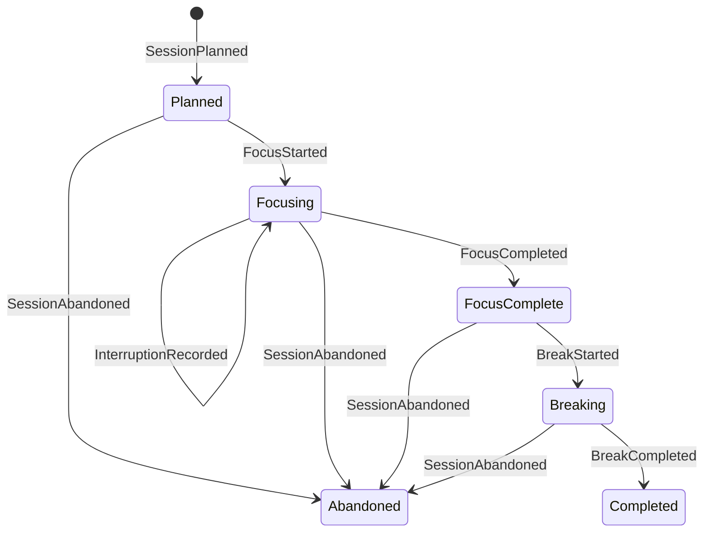

# GWorker

GWorker is becoming a local-first engine for adaptive focus experiments. Instead
of treating a timer as the product, it models each work block as an auditable
sequence of domain events that can later be replayed, evaluated, and used by a
privacy-preserving recommendation policy.

> **Development status:** the event-sourced domain foundation and transactional
> local journal are implemented. The adaptive policy, counterfactual evaluation,
> the CLI, and reproducible visual evidence are the next incremental milestones.
> This README deliberately does not claim that those pieces exist yet.

## Why an event log?

A conventional timer remembers only the current countdown. That makes crash
recovery, debugging, and honest policy evaluation difficult. GWorker instead
reduces immutable events into state:



The reducer rejects gaps, out-of-order timestamps, cross-session events, and
invalid transitions. A future policy can therefore learn from an explicit
outcome history instead of silently inferring success from a countdown reaching
zero.

## Current scope

- Immutable, typed events for planning, focus, interruptions, breaks, and
  abandonment.
- A pure reducer with strict revision and transition checks.
- A small state projection with measured focus and interruption totals.
- A canonical, versioned JSON event codec that rejects unknown fields.
- A private SQLite journal using WAL, `synchronous=FULL`, transactional appends,
  unique aggregate revisions, integrity checks, and full replay verification.
- Standard-library tests; the runtime currently has no third-party
  dependencies.

Run the foundation checks:

```bash
PYTHONPATH=src python3 -m unittest discover -s tests -v
PYTHONPATH=src python3 -m compileall -q src tests
```

## Design boundaries

GWorker is intended for personal self-experimentation, not employee monitoring.
It has no dedicated identity fields, device fingerprinting, remote analytics, or
background surveillance. A local journal still contains sensitive behavioral
data: objective text, UTC timestamps, durations, interruptions, and abandonment
reasons. Journals therefore stay on the user's machine by default and are
ignored by Git. An objective can itself contain a name or account identifier;
GWorker cannot infer and redact that safely. Synthetic fixtures—not a
developer's real work history—will power committed demos and screenshots.

The journal is permission-hardened, not encrypted by GWorker. Device or
full-disk encryption remains the protection against an attacker who can read the
user's files. The hardened storage backend currently targets Linux/POSIX
filesystems; a Windows security backend is not implemented.

The path and permission checks defend against other local OS users and
accidental file substitution. A hostile process already running as the same Unix
user is outside this boundary: it can read or rewrite that user's database
directly. Replay verification detects malformed or inconsistent data; it is not
a cryptographic authenticity proof against such a process.

The adaptive milestone will recommend a work-block duration and expose the
evidence behind that choice. It will not assign a universal “productivity
score,” diagnose health conditions, or claim causal effects from observational
data.

## Rehabilitation note

The repository's single 2023 commit is preserved as historical context. That
upload contained a broken Pomodoro prototype with import-time file writes,
undeclared audio dependencies, and plaintext name storage. The implementation
on this branch is a ground-up replacement and does not reuse, import, or package
the legacy modules.

No license has been added. Repository control does not by itself establish the
rights needed to license the historical upload, so licensing remains an explicit
release decision for Omar.

## Roadmap

1. Deterministic CLI simulation and crash-recovery workflow.
2. Contextual duration policy with logged action probabilities.
3. Offline replay evaluation with uncertainty and baseline comparisons.
4. Reproducible CLI captures, architecture diagrams, result plots, and a short
   terminal demo generated from synthetic data.
