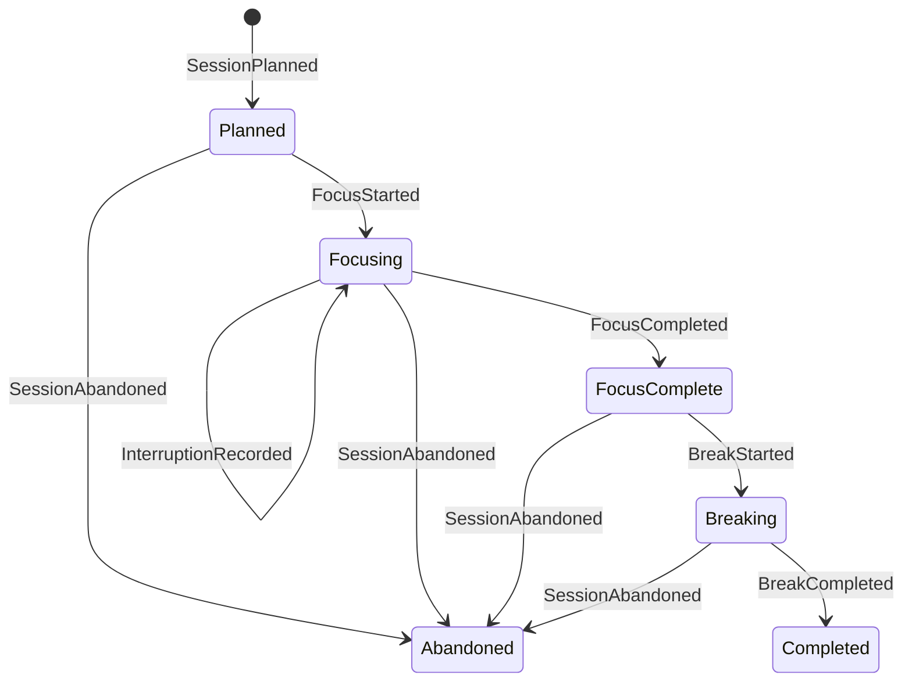
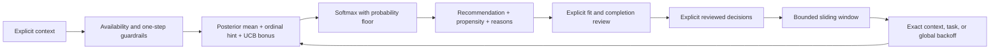

# GWorker

GWorker is becoming a local-first engine for adaptive focus experiments. Instead
of treating a timer as the product, it models each work block as an auditable
sequence of domain events that can later be replayed, evaluated, and used by a
privacy-conscious recommendation policy.

> **Development status:** the event-sourced domain foundation and transactional
> local journal are implemented, together with an explainable adaptive-duration
> policy. A locked synthetic evaluation engine and its pre-registered protocol
> are also implemented. Seed-level stratified bootstrap statistics and a clean
> source-provenance gate are in place. A fail-closed
> [publication evidence contract](docs/publication-evidence.md) now preserves
> all result denominators and required visual rows; the publication runner,
> full locked run, and generated result visuals have not been produced yet.
> Journal integration and the end-user CLI remain later milestones.

## Why an event log?

A conventional timer remembers only the current countdown. That makes crash
recovery, debugging, and honest policy evaluation difficult. GWorker instead
reduces immutable events into state:



The reducer rejects gaps, out-of-order timestamps, cross-session events, and
invalid transitions. The policy can therefore learn from an explicit outcome
history instead of silently inferring success from a countdown reaching zero.

## How the duration policy works

The policy chooses among four bounded focus/break templates: 15/3, 25/5, 40/8,
and 50/10 minutes. It uses only a coarse task category, self-reported energy,
available time, the previous template, and completed explicit reviews. It never
reads objective text.



For each feasible template, the scorer combines:

- a shrinkage posterior over a bounded reward: 80% “duration felt right” and
  20% explicit objective completion;
- a small, separately exposed ordinal adjustment when the user says a reviewed
  duration was too short or too long;
- an uncertainty bonus that keeps under-observed templates discoverable.

Softmax sampling converts those scores into logged action probabilities. Every
feasible action retains a configured probability floor (2% by default), which
supports later propensity-aware evaluation instead of hiding deterministic
selection bias. Availability is checked against the complete focus-plus-break
budget. If a previous duration exists, the recommendation normally moves at
most one adjacent template.

Each recommendation carries its caller-supplied UUID and monotonic sequence,
exact propensity, evidence bucket, per-arm score decomposition, and reason
codes. Its policy ID contains a deterministic SHA-256 fingerprint of the full
configuration and template set. Numerically equivalent configuration values are
canonicalized before hashing.

The kernel inspects at most the final configured number of reviews and requires
that tail to be ordered oldest-to-newest by a strictly increasing decision
sequence. Within that bounded tail it fails closed on a duplicate decision,
foreign policy configuration, unknown template, or guardrail-violating action.
The future journal integration will own global uniqueness across reviews that
have already fallen out of the learning window.

`Recommendation.review()` preserves the chosen action and its propensity.
Directly constructing a `ReviewedDecision` validates its structure but cannot
prove that the probability originated from a recommendation. Propensity-aware
evaluation will therefore wait for journal-backed recommendation/review
linkage; the current implementation makes no verified-log claim.

The ordinal adjustment is a transparent preference heuristic, not observed
counterfactual reward and not evidence that a longer or shorter session causes
better work. The [locked synthetic evaluation
protocol](docs/evaluation-protocol.md) freezes the personas, randomization,
baselines, common availability-only primary contrast, diagnostics, and
interpretation boundary before the full evaluation seeds are run. A separate
path-opportunity term prevents a strategy from looking good merely because its
previous choices trapped it behind the one-step guardrail.

## Current scope

- Immutable, typed events for planning, focus, interruptions, breaks, and
  abandonment.
- A pure reducer with strict revision and transition checks.
- A small state projection with measured focus and interruption totals.
- A canonical, versioned JSON event codec that rejects unknown fields.
- A private SQLite journal using WAL, `synchronous=FULL`, transactional appends,
  unique aggregate revisions, integrity checks, and full replay verification.
- A sliding-window hierarchical softmax-UCB duration policy with explicit
  feedback, bounded exploration, logged propensities, and explainable arm
  scores.
- A standard-library synthetic evaluation engine with balanced contexts,
  coherent paired potential outcomes, four fixed baselines, a last-choice
  baseline, an analytic myopic oracle that never sees realized outcomes,
  common/path regret decomposition, pooled sufficient statistics, runtime
  completeness checks, and seed-level adaptive-replica aggregation.
- Standard-library tests; the runtime currently has no third-party
  dependencies.

Run the foundation checks:

```bash
PYTHONPATH=src python3 -m unittest discover -s tests -v
PYTHONPATH=src python3 -m compileall -q src tests
```

## Design boundaries

GWorker is intended for personal self-experimentation, not employee monitoring.
It has no dedicated identity fields, device fingerprinting, remote analytics, or
background surveillance. A local journal still contains sensitive behavioral
data: objective text, UTC timestamps, durations, interruptions, and abandonment
reasons. Explicit policy reviews additionally retain coarse task kind,
self-reported energy, availability, prior duration, chosen template, fit,
completion, and propensity. Journals therefore stay on the user's machine by
default and are ignored by Git. An objective can itself contain a name or
account identifier; GWorker cannot infer and redact that safely. Synthetic
fixtures—not a developer's real work history—will power committed demos and
screenshots.

The journal is permission-hardened, not encrypted by GWorker. Device or
full-disk encryption remains the protection against an attacker who can read the
user's files. The hardened storage backend currently targets Linux/POSIX
filesystems; a Windows security backend is not implemented.

The path and permission checks defend against other local OS users and
accidental file substitution. A hostile process already running as the same Unix
user is outside this boundary: it can read or rewrite that user's database
directly. Replay verification detects malformed or inconsistent data; it is not
a cryptographic authenticity proof against such a process.

The adaptive policy recommends a work-block duration and exposes the evidence
behind that choice. It does not assign a universal “productivity score,”
diagnose health conditions, or claim causal effects from observational data.
Only an explicit reviewed decision can enter its learning history; merely
starting a timer, leaving a window open, or generating a recommendation creates
no learning signal.

## Rehabilitation note

The repository's single 2023 commit is preserved as historical context. That
upload contained a broken Pomodoro prototype with import-time file writes,
undeclared audio dependencies, and plaintext name storage. The implementation
on this branch is a ground-up replacement and does not reuse, import, or package
the legacy modules.

No license has been added. Repository control does not by itself establish the
rights needed to license the historical upload, so licensing remains an explicit
release decision for Omar.

## Roadmap

1. Run the pre-registered synthetic evaluation, calculate paired seed-level
   uncertainty, and generate the complete result tables and plots without
   changing the locked policy or evaluator.
2. Journal integration plus a deterministic CLI simulation and crash-recovery
   workflow.
3. Offline replay evaluation with propensity diagnostics and baseline
   comparisons.
4. Reproducible CLI captures and a short terminal demo generated from synthetic
   data.
