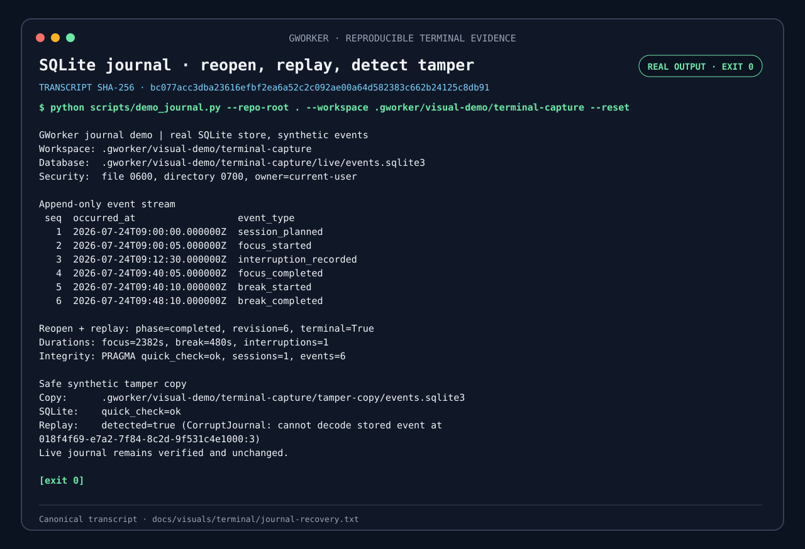
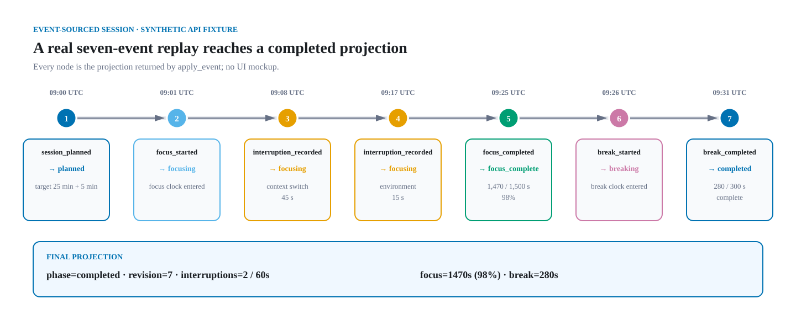
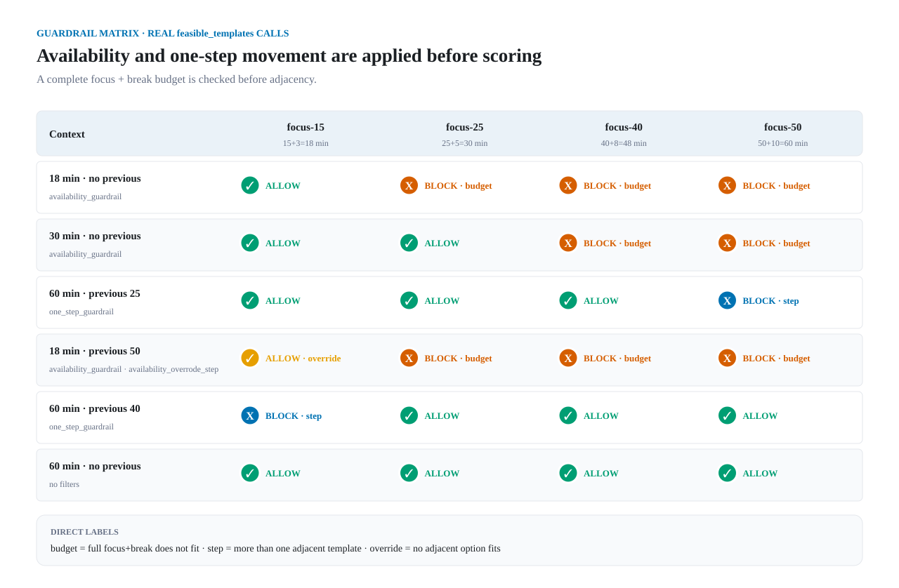
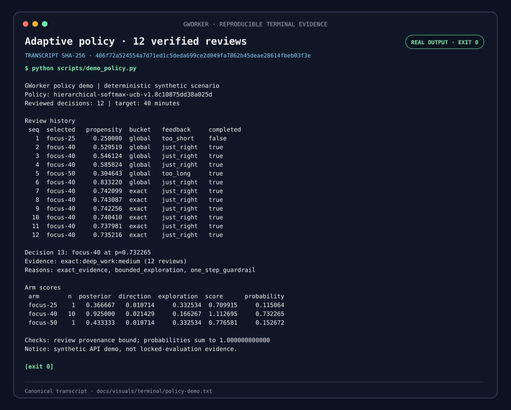
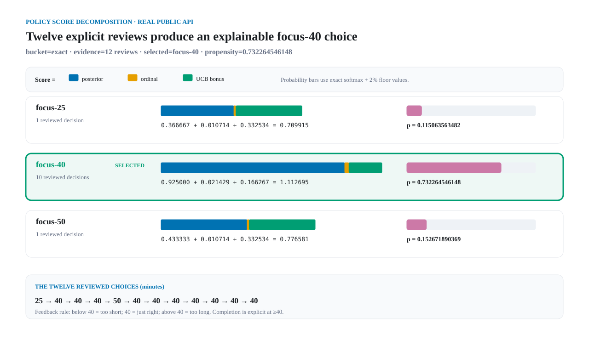
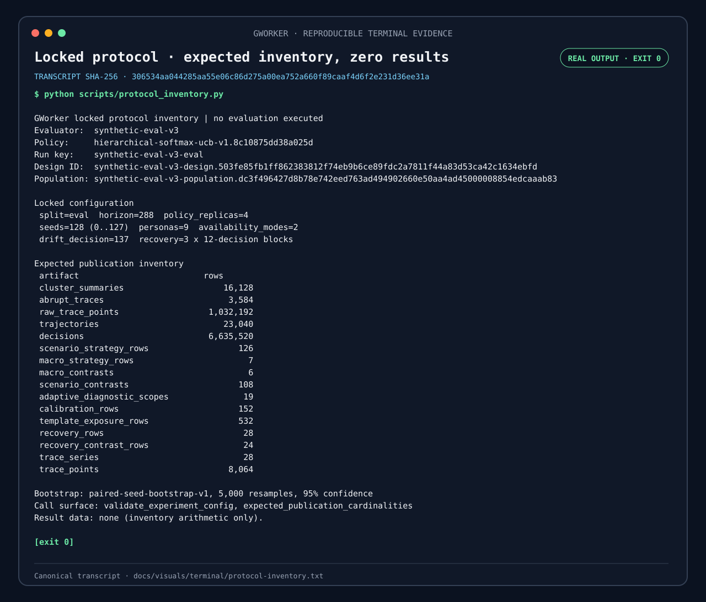
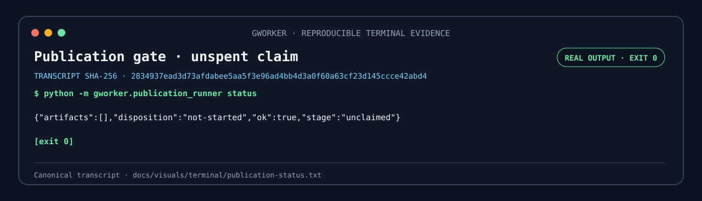
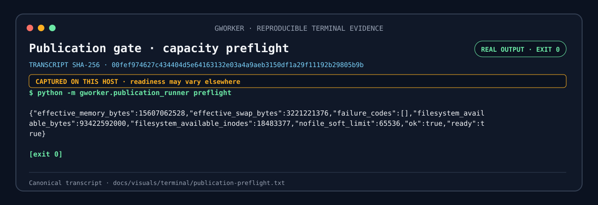

# GWorker

GWorker is a local-first, event-sourced engine for adaptive focus experiments.
Instead of treating a timer as the product, it models each work block as an
auditable event stream, replays that stream into state, and recommends a
bounded duration from explicit context and reviews.

> **Development status:** the domain reducer, canonical event codec, private
> SQLite journal, explainable duration policy, locked synthetic evaluator,
> reporting/evidence builders, canonical result codecs, and the fail-closed
> publication runner are implemented.
> Three deterministic synthetic demos, six source-derived non-result diagrams,
> and five genuine terminal captures are reproducible from the repository. The
> locked evaluation has **not** run: there are zero locked outcome artifacts and
> no benchmark result plots. Journal-to-policy provenance linkage, an end-user
> CLI, publication rendering, and final sealing remain future work.


*The solid boxes are implemented; dashed boxes are explicit next steps. See the
[component contracts and trust boundaries](docs/architecture.md).*

## See it run

The journal demo writes synthetic events through the production
`SQLiteEventStore`, closes and reopens the database, replays the session, and
detects a logical mutation in a separate copy.

[](docs/visuals/terminal/journal-recovery.txt)

*Genuine terminal output; click the image for the sanitized transcript. This
demo contains six events and ends at revision 6. The seven-event/revision-7
fixture below is a separate domain-reducer example.*

Run all three safe demos:

```bash
PYTHONPATH=src python3 scripts/demo_policy.py
PYTHONPATH=src python3 scripts/demo_journal.py \
  --repo-root "$PWD" \
  --workspace .gworker/visual-demo/readme \
  --reset
PYTHONPATH=src python3 scripts/protocol_inventory.py
```

The demos use only synthetic fixtures. The inventory command validates locked
configuration and expected cardinalities; it does not call the evaluator or
publication runner.

## Why an event log?

A conventional timer remembers only the current countdown. That makes crash
recovery, debugging, and honest policy evaluation difficult. GWorker instead
reduces immutable events into state:



*This source-derived synthetic fixture applies seven events and reaches
revision 7. It is intentionally distinct from the six-event persisted-journal
demo above.*

The pure reducer rejects gaps, out-of-order timestamps, cross-session events,
and invalid transitions. The policy can therefore learn from an explicit
review history instead of silently inferring success from a countdown reaching
zero.

## How the duration policy works

The policy chooses among four bounded focus/break templates: 15/3, 25/5, 40/8,
and 50/10 minutes. It uses only a coarse task category, self-reported energy,
available time, the previous template, and completed explicit reviews. It never
reads objective text.



*Six real `feasible_templates()` calls show that the complete focus-plus-break
budget and one-step movement rule are applied before an arm is scored.*

For each feasible template, the scorer combines:

- a shrinkage posterior over a bounded reward: 80% “duration felt right” and
  20% explicit objective completion;
- a small, separately exposed ordinal adjustment when the user says a reviewed
  duration was too short or too long;
- an uncertainty bonus that keeps under-observed templates discoverable.

Softmax sampling converts those scores into logged action probabilities. Every
feasible action retains a configured probability floor (2% by default), which
supports later propensity-aware evaluation instead of hiding deterministic
selection bias. Availability is checked against the complete focus-plus-break
budget. If a previous duration exists, the recommendation normally moves at
most one adjacent template.

[](docs/visuals/terminal/policy-demo.txt)

*Genuine terminal output; click for the transcript. The synthetic fixture's
thirteenth recommendation is `focus-40`; this is an API demonstration, not a
claim that 40 minutes is optimal for people or a locked-evaluation result.*



*The same deterministic fixture exposes each feasible arm's review count,
posterior, ordinal adjustment, exploration bonus, total score, and exact
softmax probability.*

Each recommendation carries its caller-supplied UUID and monotonic sequence,
exact propensity, evidence bucket, per-arm score decomposition, and reason
codes. Its policy ID contains a deterministic SHA-256 fingerprint of the full
configuration and template set. Numerically equivalent configuration values are
canonicalized before hashing.

The kernel inspects at most the final configured number of reviews and requires
that tail to be ordered oldest-to-newest by a strictly increasing decision
sequence. Within that bounded tail it fails closed on a duplicate decision,
foreign policy configuration, unknown template, or guardrail-violating action.
Future journal-to-policy linkage will own global uniqueness across reviews
that have already fallen out of the learning window.

`Recommendation.review()` preserves the chosen action and its propensity.
Directly constructing a `ReviewedDecision` validates its structure but cannot
prove that the probability originated from a recommendation. Propensity-aware
evaluation will therefore wait for journal-backed recommendation/review
linkage; the current implementation makes no verified-log claim.

The ordinal adjustment is a transparent preference heuristic, not observed
counterfactual reward and not evidence that a longer or shorter session causes
better work. The [locked synthetic evaluation
protocol](docs/evaluation-protocol.md) freezes the personas, randomization,
baselines, common availability-only primary contrast, diagnostics, and
interpretation boundary before the full evaluation seeds are run. A separate
path-opportunity term prevents a strategy from looking good merely because its
previous choices trapped it behind the one-step guardrail.

## Locked evaluation: protocol, not benchmark results

The [synthetic evaluation protocol](docs/evaluation-protocol.md) freezes the
population, randomization namespaces, comparators, primary contrast,
uncertainty calculation, and interpretation boundary before the held-out run.
The [publication evidence contract](docs/publication-evidence.md) separately
fixes every required denominator and output row.


*These are cardinality invariants calculated from the locked configuration,
not processed observations. In particular, the 6,635,520 decisions shown here
are expected workload for a future complete run; none has been evaluated as a
locked result.*

[](docs/visuals/terminal/protocol-inventory.txt)

*Genuine terminal output; click for the transcript. The command calls only the
configuration validator and expected-cardinality calculator. It reports zero
result data and never invokes the evaluator.*

## Current scope

- Immutable, typed events for planning, focus, interruptions, breaks, and
  abandonment.
- A pure reducer with strict revision and transition checks.
- A small state projection with measured focus and interruption totals.
- A canonical, versioned JSON event codec that rejects unknown fields.
- A private SQLite journal using WAL, `synchronous=FULL`, transactional appends,
  unique aggregate revisions, integrity checks, and full replay verification.
- A sliding-window hierarchical softmax-UCB duration policy with explicit
  feedback, bounded exploration, logged propensities, and explainable arm
  scores.
- A standard-library synthetic evaluation engine with balanced contexts,
  coherent paired potential outcomes, four fixed baselines, a last-choice
  baseline, an analytic myopic oracle that never sees realized outcomes,
  common/path regret decomposition, pooled sufficient statistics, runtime
  completeness checks, and seed-level adaptive-replica aggregation.
- Canonical result/report/evidence builders and codecs, plus an append-only
  publication state chain bound to the exact clean source.
- A Linux fail-closed publication runner with private descriptor-relative I/O,
  immutable artifact publication, crash recovery, burn-on-reopen semantics for
  an interrupted evaluation, and a read-only resource preflight.
- Three deterministic synthetic demos plus reproducible source-derived and
  terminal visual-evidence pipelines.
- Standard-library tests; the runtime currently has no third-party
  dependencies.

## Publication gate: unclaimed and fail-closed


*Implemented control flow reaches canonical materialization. Result rendering
and final sealing are explicitly marked `NEXT`; the diagram describes code
paths, not an executed run.*

Inspecting the held-out namespace is safe and read-only:

```bash
PYTHONPATH=src python3 -m gworker.publication_runner --repo-root "$PWD" status
PYTHONPATH=src python3 -m gworker.publication_runner --repo-root "$PWD" preflight
```

[](docs/visuals/terminal/publication-status.txt)

*The recorded status is `unclaimed`, `not-started`, with no artifacts. Click
for the path-free transcript.*

[](docs/visuals/terminal/publication-preflight.txt)

*This host-dependent capture failed the frozen memory and swap headroom checks
and exited 2 without claiming the run. Capacity can differ on another host;
this is not a portable readiness result.*

`preflight` is read-only. It first requires an exact clean committed checkout,
then checks effective cgroup-aware memory, swap, filesystem bytes, inodes, and
the file-descriptor limit. A failing preflight exits with code 2 and creates no
run directory or evaluation permit.

The `run` command is intentionally not a routine demo command. It has no force,
reset, or evaluation-retry flag. Once it durably enters `EVALUATING`, a process
restart treats that run as burned rather than silently consuming the held-out
namespace again. Run it only on the clean source commit that will be published,
and only after `preflight` reports `"ready":true`.

## Verification and provenance

Run the code and evidence checks without consuming the locked namespace:

```bash
PYTHONPATH=src python3 -m unittest discover -s tests -v
PYTHONPATH=src python3 -m compileall -q src tests
PYTHONPATH=src python3 scripts/visuals/generate.py --check
PYTHONPATH=src python3 scripts/visuals/capture_terminal.py check
```

The [source-derived visual manifest](docs/visuals/manifest.json) binds the
generator, documentation and implementation inputs, every SVG checksum, and
the observation that locked outcome artifact count is zero. The
[terminal-capture manifest](docs/visuals/terminal/manifest.json) binds five
literal command vectors, exact source bytes, normalized capture environment,
exit codes, transcripts, and rendered SVGs. Its `check` mode is read-only and
does not rerun the commands or host-dependent preflight.

Both pipelines are standard-library-only, reject external image/script
references, and use synthetic demo records. Publication outcome visuals will
be generated only from validated, provenance-bound locked evidence and bound
into the final manifest before sealing; they do not exist today.

## Design boundaries

GWorker is intended for personal self-experimentation, not employee monitoring.
It has no dedicated identity fields, device fingerprinting, remote analytics, or
background surveillance. A local journal still contains sensitive behavioral
data: objective text, UTC timestamps, durations, interruptions, and abandonment
reasons. Explicit policy reviews additionally retain coarse task kind,
self-reported energy, availability, prior duration, chosen template, fit,
completion, and propensity. Journals therefore stay on the user's machine by
default and are ignored by Git. An objective can itself contain a name or
account identifier; GWorker cannot infer and redact that safely. Synthetic
fixtures—not a developer's real work history—power the committed demos and
visuals.

The journal is permission-hardened, not encrypted by GWorker. Device or
full-disk encryption remains the protection against an attacker who can read the
user's files. The hardened storage backend currently targets Linux/POSIX
filesystems; a Windows security backend is not implemented.

The path and permission checks defend against other local OS users and
accidental file substitution. A hostile process already running as the same Unix
user is outside this boundary: it can read or rewrite that user's database
directly. Replay verification detects malformed or inconsistent data; it is not
a cryptographic authenticity proof against such a process.

The adaptive policy recommends a work-block duration and exposes the evidence
behind that choice. It does not assign a universal “productivity score,”
diagnose health conditions, or claim causal effects from observational data.
Only an explicit reviewed decision can enter its learning history; merely
starting a timer, leaving a window open, or generating a recommendation creates
no learning signal.

## Rehabilitation note

The repository's single 2023 commit is preserved as historical context. That
upload contained a broken Pomodoro prototype with import-time file writes,
undeclared audio dependencies, and plaintext name storage. The implementation
on this branch is a ground-up replacement and does not reuse, import, or package
the legacy modules.

No license has been added. Repository control does not by itself establish the
rights needed to license the historical upload, so licensing remains an explicit
release decision for Omar.

## Next milestones

1. Implement deterministic result rendering and connect the runner's
   materialized evidence to an immutable manifest and final sealed state.
2. On a clean host that passes the frozen resource gate, execute the
   pre-registered locked evaluation exactly once and publish every required
   result, denominator, diagnostic, and negative finding.
3. Add journal-backed recommendation/review linkage and an end-user CLI
   workflow.
4. Add offline replay evaluation with propensity provenance diagnostics and
   declared baseline comparisons.
5. Produce a short pinned terminal demo from the synthetic workflow once the
   CLI exists; keep its transcript and source hashes reproducible.
