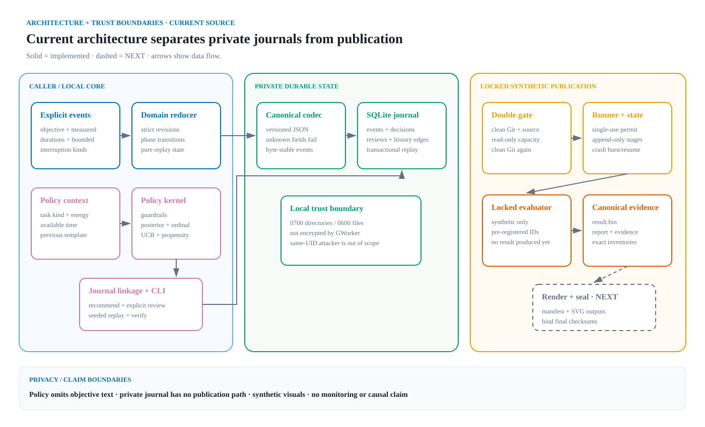
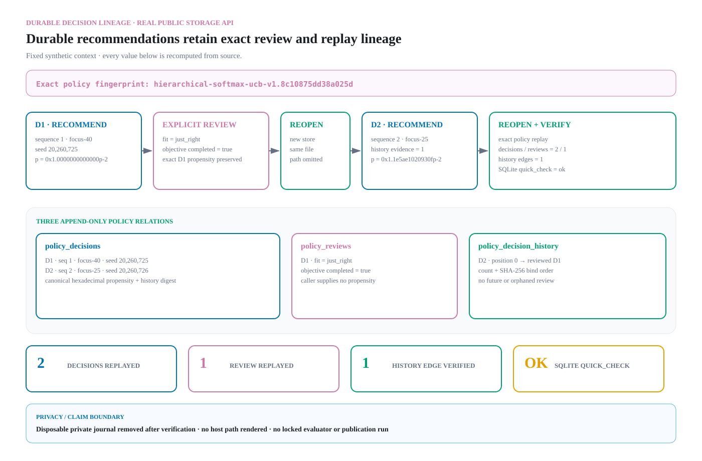

# GWorker architecture

GWorker separates a private, event-sourced work journal from a synthetic
evaluation and publication path. The boundary is deliberate: real objective
text never enters the adaptive policy or benchmark, and committed evidence uses
synthetic fixtures only.

## System map



Solid boxes are implemented in the current source. Dashed boxes are future
integration work. The publication side is a control flow, not a result: the
locked evaluation has not run and no locked outcome artifact exists. The
private journal has no data-flow edge into the synthetic publication path;
publication consumes frozen source/configuration and synthetic evaluation
artifacts, never a user's local work history.

## Component contracts

| Component | Accepts | Produces and enforces | Failure boundary | Source |
| --- | --- | --- | --- | --- |
| Domain model and reducer | Typed events with one session ID, revision, and UTC timestamp | Pure `SessionState` projection with measured focus, break, and interruption totals | Rejects gaps, time reversal, cross-session events, and illegal phase transitions | [`domain.py`](../src/gworker/domain.py#L376) |
| Canonical event codec | One known domain-event variant | Versioned, byte-stable JSON with exact keys | Rejects duplicate/unknown fields, unknown event types, invalid values, and non-canonical structure | [`codec.py`](../src/gworker/codec.py#L71) |
| SQLite event store | A private journal path and one next event | Transactional append, unique aggregate revision, full replay, and integrity summary | Linux/POSIX path, ownership, permission, file-identity, schema, codec, and replay checks fail closed | [`storage.py`](../src/gworker/storage.py#L95) |
| Duration policy | Explicit coarse context, an ordered bounded review tail, and caller RNG | Feasible templates, per-arm score decomposition, sampled action, exact propensity, evidence bucket, and reason codes | Rejects foreign policy IDs, duplicate/non-increasing decisions, unknown templates, invalid probability structure, and impossible histories | [`policy.py`](../src/gworker/policy.py#L387) |
| Durable policy lineage | Current policy fingerprint, bounded context, caller UUID/seed, and closed review fields | Append-only decisions, reviews, exact ordered history edges, canonical propensities, and deterministic replay | Rejects stale/forged policy objects, sequence or schema damage, orphan/duplicate reviews, altered history, and any recomputation mismatch | [`storage.py`](../src/gworker/storage.py#L1218), [`decision-lineage.md`](decision-lineage.md) |
| Focus-session linkage | Exact policy, durable decision UUID, and an existing revision-1 plan | Immutable one-to-one provenance link with a session-derived lookup; no inferred review | Rejects reviewed or already-linked decisions, started sessions, policy/template/duration mismatch, link corruption, and concurrent consumption | [`storage.py`](../src/gworker/storage.py), [`session-linkage.md`](session-linkage.md) |
| Policy CLI | Explicit `recommend`, `review`, or `verify` arguments and an optional private journal path | Human or canonical JSON output without objective text or journal paths | Invalid arguments are not echoed; operational errors use stable categories; verification is explicitly policy-scoped | [`cli.py`](../src/gworker/cli.py#L89) |
| One-step offline replay | Strictly ordered reviewed rows plus behavior, uniform, or score-temperature target | Aggregate raw/clipped IPS and SNIPS, effective sample size, template sufficient statistics, raw-support readiness, and exact behavior control | Rejects malformed or excessive snapshots, impossible target floors, non-finite arithmetic, and any promoted interpretation flag | [`offline.py`](../src/gworker/offline.py), [`offline-replay.md`](offline-replay.md) |
| Synthetic evaluator | An explicit experiment configuration; locked `eval` additionally requires the private consumed permit | Balanced synthetic environments, paired potential outcomes, strategy summaries, traces, and exact cardinality validation | Any missing scenario, invariant breach, non-finite probability, invalid guardrail choice, or denominator mismatch invalidates the whole run | [`evaluation.py`](../src/gworker/evaluation.py#L2818) |
| Result, report, and evidence codecs | Complete validated evaluator output | Canonical binary result plus canonical statistical-report and publication-evidence documents | Decode, schema, identity, count, sufficient-statistic, and exact round-trip checks reject partial or altered data | [`result_codec.py`](../src/gworker/result_codec.py#L1182), [`reporting.py`](../src/gworker/reporting.py#L963), [`evidence.py`](../src/gworker/evidence.py#L2470), [`publication_codec.py`](../src/gworker/publication_codec.py#L1056) |
| Publication state and runner | Clean committed source, a capacity assessment, and the fixed run key | Append-only state records, one evaluation permit, immutable artifacts, resumable materialization, and path-free status | Preflight failure does not claim; reopening `EVALUATING` burns the run; existing artifact mismatch fails; there is no force/reset/retry flag | [`publication_state.py`](../src/gworker/publication_state.py#L1240), [`publication_runner.py`](../src/gworker/publication_runner.py#L2051), [`resource_preflight.py`](../src/gworker/resource_preflight.py#L1672) |
| Reproducible evidence tools | Reviewed, literal demo inputs and committed source bytes | Twelve source-derived diagrams, seven sanitized terminal captures, and one real four-process CLI motion bundle with checksum manifests | No arbitrary shell command surface; visual checks compare exact bytes; motion `render`/`check` are process-free; no evaluator or publication `run` call | [`generate.py`](../scripts/visuals/generate.py), [`generate_offline_replay.py`](../scripts/visuals/generate_offline_replay.py), [`capture_terminal.py`](../scripts/visuals/capture_terminal.py), [`capture_cli_motion.py`](../scripts/visuals/capture_cli_motion.py) |
| Continuous verification | Exact checkout, pinned development tools, and commit-bound build timestamps | Python 3.11–3.14 quality/coverage, four evidence checks, complete sdist, byte-reproduced wheel, and installed CLI smoke | Read-only permissions and checkout; unsafe/incomplete archives, altered source, metadata/`RECORD` drift, coverage below 90%, or any changed tracked file fail the workflow | [`ci.yml`](../.github/workflows/ci.yml), [`verify_distribution.py`](../scripts/verify_distribution.py), [`continuous-verification.md`](continuous-verification.md) |

## Event reduction and durable journal

Callers create immutable domain events. `apply_event()` validates one
transition and returns a new projection; `reduce_events()` folds the same
contract over a complete stream. The reducer has no database or clock side
effects, so replay is the canonical way to reconstruct state.

The event codec records the schema version and exact event fields. The
`SQLiteEventStore` persists those canonical documents with WAL,
`synchronous=FULL`, transactional append, and a unique
`(session_id, sequence)` primary key. Opening, appending, loading, replaying,
and verifying recheck the expected private directory and file. `verify()` runs
SQLite integrity checks and decodes/replays every stored stream; structurally
valid SQLite bytes are not enough if a domain event no longer decodes or
replays.

The [journal terminal capture](visuals/terminal/journal-recovery.txt) exercises
the production store with six synthetic events, reopens it at revision 6, and
detects a logical mutation in a separate copy. The
[source-bound recovery architecture](visuals/generated/journal-recovery-trust-boundaries.svg)
reads only that committed transcript and terminal manifest, verifies the exact
recorder, transcript, terminal SVG, and six production-source SHA-256 records,
then renders the observed CLI/storage/replay boundaries without executing a
command. It documents one known logical mutation: SQLite `quick_check` accepts
the copied container, while canonical event decode rejects its altered third
record. The transcript reports the live journal unchanged, but this
capture-derived diagram does not independently recompute that boolean. It is
not arbitrary-corruption coverage or a cryptographic authenticity claim. The
[seven-event replay diagram](visuals/generated/event-replay.svg) is a distinct
in-memory reducer fixture ending at revision 7.

## Recommendation path

The policy receives only `TaskKind`, self-reported `EnergyLevel`, available
seconds, the previous template, and completed explicit reviews. It never reads
objective text.

1. `feasible_templates()` applies the complete focus-plus-break budget and
   one-step movement guardrail.
2. The bounded review tail backs off from exact context to task or global
   evidence when necessary.
3. Each feasible arm exposes its shrinkage posterior, ordinal preference hint,
   uncertainty bonus, and total score.
4. Softmax sampling retains the configured probability floor and returns the
   chosen action with its exact propensity and reason codes.
5. `SQLiteEventStore.recommend()` commits the UUID, database-owned sequence,
   policy fingerprint, seed, context, selected action, exact propensity, and
   every ordered history edge in one transaction.
6. Apart from the exact policy object, `record_review()` accepts only that
   decision UUID and closed feedback, recomputes the recommendation, and binds
   the review to the preserved action and propensity.

The [policy demo](../scripts/demo_policy.py) runs twelve sequential
recommendation/review calls and prints the thirteenth recommendation. Its
`focus-40` choice is fixture behavior, not evidence of an optimal duration or a
human outcome. The separate
[durable workflow](visuals/terminal/durable-policy-workflow.txt) makes two
decisions through the public CLI handler, closes/reopens the store on every
command, records one explicit review, and verifies a `2 / 1 / 1`
decision/review/history-edge lineage.

Opening the journal validates the exact schema definition. Policy replay uses
three bulk reads to build an immutable snapshot, reconstructs the canonical
policy from the supplied configuration, requires its fingerprint to match the
stored rows, and recomputes every decision for that policy from context, seed,
and ordered history. The same verification transaction also enforces
database-wide relational invariants. Its reported decision/review/history
counts are policy-scoped; it does not imply that rows for another policy
fingerprint were recomputed.



Schema v3 implements the optional
[one-to-one association](session-linkage.md) outside canonical event bytes.
The link references a durable decision and the exact sequence-1
`SessionPlanned` event; its lookup derives `session_id` through that event.
Event-codec v1 is unchanged, unlinked histories remain valid, and only an
explicit `record_review()` changes policy history. Objective text remains
outside the policy log, although the identifier link increases joinability.

## Isolated offline replay evidence

The pure replay core accepts a bounded, strictly ordered typed snapshot; it
validates that arithmetic boundary but does not attest journal provenance.
Verified journal extraction remains the caller's separate future
responsibility. The committed demonstration supplies sixteen authored
synthetic rows directly, so it does not open the private journal or imply that
extraction is implemented. The behavior target is an executable exact negative
control. The score-temperature candidate reports finite-snapshot raw and
clipped descriptive summaries, raw support gates, and per-template sufficient
statistics with all interpretation flags fixed to `false`.

The genuine [offline terminal capture](visuals/terminal/offline-replay.txt)
records only the aggregate demo output. A separate offline-only generator calls
the public replay API for the complete report and each synthetic row, then
renders aligned propensity/weight, estimator-decomposition, and
support/coverage SVGs. Its [manifest](offline/manifest.json) binds the fixture,
sources, terminal evidence, documentation, and output bytes. Clean-process
tests prove that this path never imports the evaluator, publication workflow,
reporting, or result codecs.

## Locked evaluation and publication

The [evaluation protocol](evaluation-protocol.md) pre-registers a synthetic
population, common availability-only primary contrast, comparators, random
namespaces, diagnostics, and paired seed-level uncertainty. The
[publication evidence contract](publication-evidence.md) fixes the exact row
inventory and denominators before any locked result is visible.

The runner's claim path is intentionally narrow:

1. require a clean committed checkout and capture its source provenance;
2. perform a read-only, cgroup-aware capacity preflight;
3. recapture and compare the clean source immediately before creating the
   private `PREPARED` run;
4. fsync `EVALUATING` before issuing the single-use in-process permit;
5. write and bind canonical `result.bin`;
6. independently rebuild and bind the statistical report and publication
   evidence.

A capacity failure stops before a run directory or permit exists. A crash after
the durable `EVALUATING` transition burns that run instead of consuming the
held-out namespace again. A restart after `EVALUATED` may reverify exact source
and artifact bytes and resume deterministic materialization.

The implemented runner stops at `MATERIALIZED`. Rendering final tables/SVGs,
binding their manifest, and invoking the existing `seal()` state transition are
`NEXT`. Current read-only status is unclaimed, and there are zero locked
outcome artifacts.

## Reproducible visual provenance

The non-result visual generator calls production APIs for the event replay,
policy scenario, feasible-template matrix, and locked expected cardinalities.
It also verifies the exact source records and output hashes behind the genuine
journal-recovery capture before deriving its recovery architecture. It emits
accessible self-contained SVG and a
[source-derived manifest](visuals/manifest.json) binding every declared input
and output checksum. `--check` generates a clean temporary bundle and requires
byte equality.

The terminal recorder has seven literal allowlisted command vectors: durable
policy workflow, policy demo, offline replay demo, journal demo, protocol
inventory, publication status, and publication preflight. Recording normalizes
locale, timezone, hash seed, paths, hostnames, and known secret signatures;
arbitrary commands are not accepted. Its
[terminal manifest](visuals/terminal/manifest.json) binds source bytes, command
arguments, sanitized transcripts, exit codes, and SVG checksums. `check` is
read-only and does not rerun the commands. The preflight capture is explicitly
host-dependent.

The isolated offline generator emits three additional SVGs and publishes its
[manifest](offline/manifest.json) last. It binds the public replay core and all
actual package imports but never imports the locked evaluator or publication
modules.

The [CLI motion recorder](cli-motion.md) requires a clean commit and compares
each recorded source byte range with that commit's Git blob before and after
capture. Its only recording workflow starts four allowlisted Python processes
with PTY stdout, separate bounded stderr, closed stdin, and one disposable
private journal. It publishes a path-free event document, accessible
transcript, eleven-frame GIF, static poster, and
[manifest](visuals/motion/manifest.json). `render` and `check` start no
application process. Frame durations are fixed presentation timing, not
latency; the exact Pillow version is pinned and the FreeType version is
recorded.

Reproduce the committed evidence without invoking the evaluator:

```bash
PYTHONPATH=src python3 scripts/visuals/generate.py --check
PYTHONPATH=src python3 -m scripts.visuals.generate_offline_replay --check
PYTHONPATH=src python3 scripts/visuals/capture_terminal.py check
PYTHONPATH=src python3 scripts/visuals/capture_cli_motion.py check
```

The pinned [continuous-verification workflow](continuous-verification.md)
executes those four checks separately from its Python 3.11–3.14 quality matrix
and distribution-integrity job. The distribution path builds its primary wheel
from the complete sdist, reproduces the same wheel independently from
`git archive HEAD`, verifies every runtime/source byte and wheel `RECORD`, then
tests the extracted sdist and an installed-wheel CLI workflow. Sdist
completeness and buildability are verified, but compressed sdist byte
reproducibility is explicitly not claimed.

## Security, privacy, and claim boundaries

- The journal is local by default and ignored by Git, but it contains sensitive
  behavioral data. Objective text can contain identifiers that GWorker cannot
  infer and redact.
- Journal directories/files are permission-hardened to `0700`/`0600`; GWorker
  does not encrypt them. Device or full-disk encryption protects data at rest.
- Descriptor-relative checks defend against other local users and accidental
  file substitution on the supported Linux/POSIX backend. A hostile process
  already running as the same Unix user is outside this boundary.
- Replay verification detects malformed and inconsistent data. It is not a
  cryptographic authenticity proof against a same-UID process that can rewrite
  the journal or source.
- The publication state chain and artifact digests detect mismatch within the
  runner contract; an unkeyed SHA-256 chain is not independent authenticity
  against a same-UID attacker.
- GWorker is for personal self-experimentation, not employee monitoring. It
  does not measure universal productivity, establish causal effects, diagnose
  health, or validate a workplace intervention.
- Synthetic benchmark results, if eventually produced, describe only the
  frozen simulator and policy. Negative and subgroup results must receive the
  same visibility as favorable ones.

## Current versus `NEXT`

| Current | `NEXT` |
| --- | --- |
| Typed events, pure session replay, canonical codec, a private schema-v3 SQLite journal, and pure one-step propensity-support diagnostics | Verified journal extraction plus a canonical aggregate offline codec and CLI |
| Journal-backed recommendation/review identity, exact propensities, and immutable decision-to-plan linkage | CLI support for explicitly linking a durable decision to a planned session |
| Frozen synthetic evaluator, report/evidence contracts, single-use runner through materialization | Deterministic result renderer, artifact manifest, and runner-driven sealing |
| Unclaimed held-out namespace with zero locked outcomes | One locked run only from the publishable clean commit on a host that passes the resource gate |
| Five demos, twelve source-derived diagrams, seven genuine terminal captures, and one real four-process CLI motion bundle | A real timer interaction surface that preserves explicit-review-only learning |
