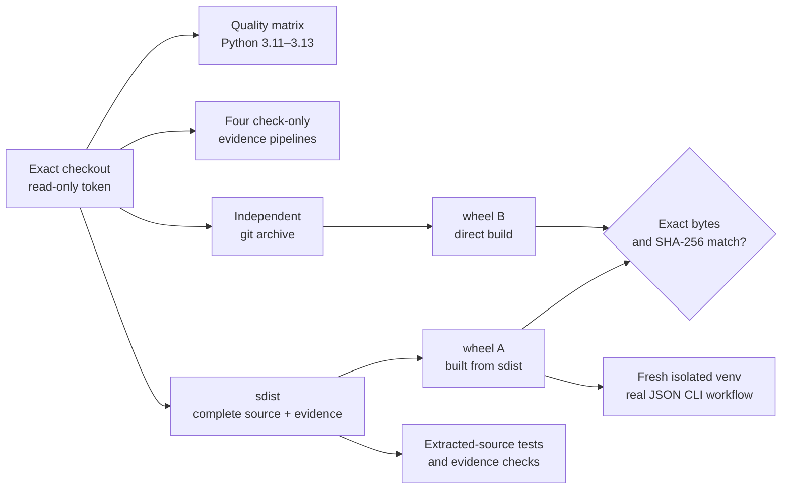

# Continuous verification

GWorker's CI contract keeps three kinds of evidence separate: language/runtime
compatibility, committed visual evidence, and installable distributions. The
workflow never calls the locked evaluator, publication `run`, motion `record`,
or host-dependent publication preflight.

The supported runtime contract is Python 3.11 through 3.13
(`>=3.11,<3.14`). Python 3.14 is intentionally excluded because its
standard-library inverse-normal implementation does not preserve the locked
evaluator's existing canonical vector; this bounded compatibility contract does
not rewrite that vector or silently accept a different result.



## Job contracts

| Job | Runs | Fails when |
| --- | --- | --- |
| Python quality matrix | Python 3.11, 3.12, and 3.13 on Ubuntu 24.04; pinned Ruff, formatting, strict mypy, compileall, the complete unittest suite, and branch coverage | A supported interpreter differs, static analysis fails, a test fails, coverage falls below 90%, or a check changes tracked source |
| Reproducible evidence | The source-derived, offline replay, terminal-capture, and real CLI motion pipelines in check-only mode | Any declared input, output byte, manifest, frame, transcript, or claim boundary differs |
| Distribution integrity | A source archive, its wheel, an independent direct wheel, safe archive verification, extracted-source tests/evidence, and a fresh-venv CLI workflow | Inventory, source bytes, metadata, `RECORD`, entry point, runtime dependency boundary, wheel bytes, storage mode, or path-disclosure contract differs |

All third-party actions are pinned to full commit SHAs. Workflow permissions are
limited to `contents: read`, checkout credentials are not persisted, jobs have
explicit timeouts, and superseded runs on the same ref are cancelled. Coverage
XML and verified distributions are retained as short-lived workflow artifacts;
no repository write permission or application secret is required.

## Distribution boundary

The primary `python -m build` invocation deliberately uses no artifact-selection
flags. The build frontend therefore creates an sdist first and builds wheel A
from that archive. Wheel B is built independently from `git archive HEAD`.
Both use `SOURCE_DATE_EPOCH` derived from the checked-out commit timestamp.

[`verify_distribution.py`](../scripts/verify_distribution.py) is a read-only,
standard-library verifier. It requires exactly one primary wheel and sdist plus
one rebuilt wheel, then checks:

- canonical, traversal-free archive paths and regular-file-only members;
- byte-identical runtime package files and a complete self-contained sdist
  containing repository configuration, package source, tests, scripts, and
  documentation/evidence;
- project name, version, Python requirement, pure-wheel tag, console entry
  point, and zero unconditional runtime `Requires-Dist` entries;
- every wheel `RECORD` path, URL-safe SHA-256 digest, and byte count; and
- byte-for-byte equality and equal SHA-256 for the two independently built
  wheels.

After safe verification, CI extracts the sdist and runs its test suite plus all
four evidence checks. The one test whose sole subject is reading `.git`
metadata is explicitly skipped in an archive without `.git`; the quality matrix
executes it in the real checkout. CI then installs the wheel with
`--no-index --no-deps` into a fresh virtual environment, runs a fixed
`recommend → review → verify` JSON workflow, verifies all three schema
versions and `journal_path_disclosed:false`, and requires journal mode `0600`.

The sdist is verified for completeness, source-byte identity, safe extraction,
and buildability. Its compressed tar bytes contain tool-generated timestamps,
so **sdist byte reproducibility is neither checked nor claimed**. Only the wheel
has a byte-reproducibility claim.

## Local parity

Run the language and evidence gates:

```bash
PYTHONPATH=src python3 -m unittest discover -s tests -v
PYTHONPATH=src coverage run --branch -m unittest discover -s tests
coverage report --show-missing --fail-under=90
ruff check .
ruff format --check .
mypy src scripts/visuals/capture_cli_motion.py scripts/verify_distribution.py
PYTHONPATH=src python3 scripts/visuals/generate.py --check
PYTHONPATH=src python3 -m scripts.visuals.generate_offline_replay --check
PYTHONPATH=src python3 scripts/visuals/capture_terminal.py check
PYTHONPATH=src python3 scripts/visuals/capture_cli_motion.py check
```

For the distribution gate, start from a clean committed checkout and use two
new empty output directories. The independent wheel is built from `HEAD`, so
the clean-tree precondition ensures both artifacts describe the same source
state:

```bash
test -z "$(git status --porcelain=v1 --untracked-files=all)"
export SOURCE_DATE_EPOCH="$(git show -s --format=%ct HEAD)"
python3 -m build --outdir build/local-dist-primary
mkdir -p build/local-rebuild-source build/local-dist-rebuild
git archive --format=tar --output=build/local-rebuild-source.tar HEAD
tar -xf build/local-rebuild-source.tar -C build/local-rebuild-source
(
  cd build/local-rebuild-source
  python3 -m build --wheel --outdir ../local-dist-rebuild
)
python3 scripts/verify_distribution.py \
  build/local-dist-primary build/local-dist-rebuild
```
