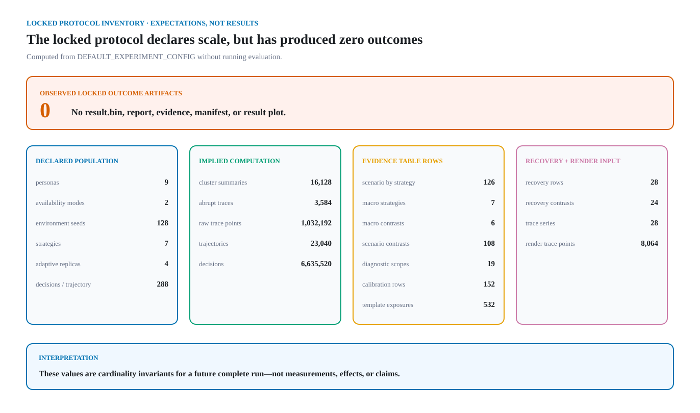
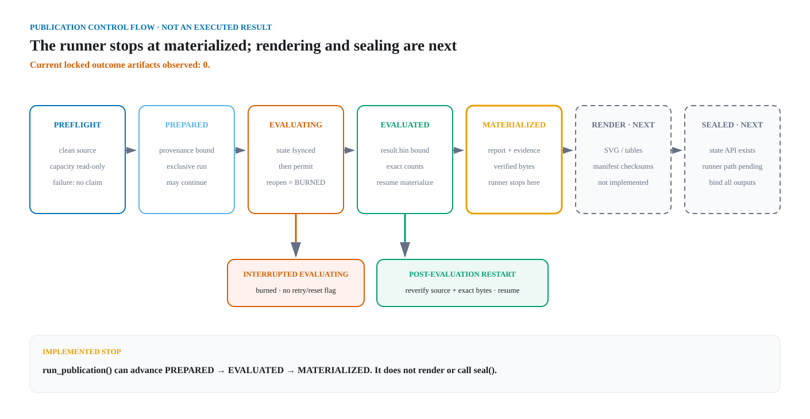

# Publication evidence contract

This document describes the renderer-independent evidence produced after one
complete GWorker synthetic experiment. It defines data grain, ordering,
denominators, and validation. It contains no benchmark outcomes: the locked
`eval` run has not been executed.

The contract separates three concerns:

1. `ExperimentResult` preserves the complete seed-level evaluator output.
2. `StatisticalReport` calculates pre-registered paired scalar contrasts.
3. `PublicationEvidence` adds the sufficient statistics and time-series rows
   required by deterministic JSON, CSV, and SVG renderers.

Presentation code may round labels, arrange panels, and choose accessible
marks. It may not filter scenarios, recompute a claim from rounded values, or
invent a denominator.

## Pre-run evidence map



*The values above are expected cardinalities calculated from the frozen
configuration. They are not processed decisions, measurements, or benchmark
results; the observed locked outcome artifact count is zero.*



*The implemented runner can advance an eligible clean run through
`MATERIALIZED`. Result rendering, the final output manifest, and runner-driven
sealing are explicitly `NEXT`; this diagram does not represent an executed
run.*

These repository-local commands inspect the contract without running the
evaluator, claiming the held-out namespace, or sampling host capacity:

```bash
PYTHONPATH=src python3 scripts/protocol_inventory.py
PYTHONPATH=src python3 scripts/visuals/generate.py --check
```

The inventory command calls only `validate_experiment_config()` and
`expected_publication_cardinalities()`. The visual check regenerates the
non-result bundle in a temporary directory and compares exact bytes. See the
[architecture contract](architecture.md#locked-evaluation-and-publication) for
the separate claim and trust boundaries.

## Locked inventory

The exact v3 population implies:

| Layer | Required count |
| --- | ---: |
| Seed-level cluster summaries | 16,128 |
| Seed-level abrupt trace records | 3,584 |
| Raw stored abrupt trace points | 1,032,192 |
| Logical trajectories | 23,040 |
| Decisions | 6,635,520 |
| Primary-macro strategy rows | 7 |
| Scenario strategy rows | 126 |
| Primary-macro contrasts | 6 |
| Scenario contrasts | 108 |
| Adaptive diagnostic scopes | 19 |
| Calibration-bin rows | 152 |
| Template-exposure rows | 532 |
| Recovery rows | 28 |
| Recovery comparator groups | 24 |
| Aggregated trace series | 28 |
| Published trace points | 8,064 |

`RunCompleteness` stores both the arithmetically expected inventory and the
observed inventory. Construction fails unless they are identical and
`hard_failure_count` is zero.

The trajectory and decision counts are not aliases for row counts:

```text
scenario seeds = 9 personas × 2 modes × 128 seeds
trajectories per scenario seed = 4 adaptive replicas + 6 comparators
decisions per trajectory = 288
```

Adaptive replicas are averaged before seed-level uncertainty is calculated.
Their additive action, review, propensity, calibration, exposure, and recovery
counts are retained rather than averaged.

## Fixed scopes and order

Every collection uses a semantic order independent of observed performance:

1. the primary macro over seven primary personas and both availability modes;
2. every persona in the declared population order;
3. every availability mode in its enum order;
4. every strategy in its enum order;
5. comparators in strategy order with `adaptive` omitted;
6. templates in the locked policy order;
7. calibration bins 0 through 7;
8. decisions 1 through the declared horizon.

Stress personas remain in scenario rows but never enter the primary macro.
Only a future forest-chart view may move `fixed-25` to the first visible line
to identify the registered comparator; the canonical evidence order does not
change.

## Strategy and guardrail evidence

Each strategy row retains:

- seed, persona, mode, trajectory, action, and horizon denominators;
- mean and mean-cumulative common regret;
- conditional choice regret and path opportunity cost;
- expected and realized reward, right-fit rate, and completion rate;
- distance from common and conditional oracles;
- seed-cluster standard error for common regret;
- counts and rates for each guardrail reason;
- feasible-set-size sum and mean;
- maximum arm transition;
- review count and rate.

Validation enforces both regret decompositions:

```text
common = conditional + path
mean cumulative = mean × horizon
```

Every rate must reconstruct from its stored count and action denominator.
Template exposures are separate rows so all four durations remain visible; the
four counts must sum to the corresponding strategy action count.

## Adaptive diagnostics

Propensity and learning-evidence diagnostics exist only for `adaptive`. There
are 18 scenario scopes plus one primary macro scope. Each row stores additive
sufficient statistics:

```text
low rate = low count / selected count
ESS ratio = inverse-weight sum²
            / (selected count × squared inverse-weight sum)
Brier score = Brier sum / Brier count
evidence share = bucket count / selected count
floor rate = floor count / arm-probability count
```

The minimum propensity and maximum inverse propensity must be reciprocals.
Exact, task, and global evidence counts must sum to selected decisions.

Calibration keeps the eight pre-registered bins. `predicted_sum`,
`observed_sum`, and `count` are authoritative. `observed_sum` must be integral.
An empty bin has `null` derived values; it is never displayed as zero
calibration error.

## Drift and trace evidence

Recovery rows exist only for `abrupt-up` and `abrupt-down`. They retain
pre-drift regret, early post-drift AUC, late regret, recovered count,
recovered-lag sum, conservative lag, trajectory count, censor lag, and maximum
searchable lag.

For locked v3:

```text
censor lag = 153
maximum recovered lag = 116
conservative lag =
    (recovered-lag sum + unrecovered count × 153) / trajectory count
```

Recovered-only lag is `null` when no trajectory recovers. It is descriptive
and is not used as a paired comparator endpoint.

Each of the 24 abrupt scenario/comparator groups carries five paired,
seed-level scalar intervals: pre-drift regret, early AUC, late regret, recovery
rate, and conservative lag. The normalized CSV projection will therefore have
120 rows.

The 28 unsmoothed trace series each contain all 288 decisions. Their intervals
are clipped pointwise normal 95% intervals over 128 seed traces. They are
explicitly not simultaneous bands and cannot establish a whole-trajectory
claim.

## Claim gate

Only the pre-registered primary contrast can produce a claim status. It uses
the unrounded `adaptive - fixed-25` common-regret interval:

```text
upper < 0  -> adaptive-lower-regret
lower > 0  -> adaptive-higher-regret
otherwise  -> not-distinguished
```

Every other interval is secondary and descriptive. No status may be translated
into a human-productivity, causal, health, or workplace claim.

The status is a derived property of the primary interval, not a second stored
field. That removes a coordinated-tampering surface but does not make an
aggregate evidence object a cryptographic proof of its bootstrap endpoints.
The publication runner must decode the committed raw `ExperimentResult`,
rebuild `StatisticalReport` with the literal locked 5,000-resample plan, require
exact report equality, and bind the raw-result, report, and evidence SHA-256
digests into both the state record and artifact manifest. A report or evidence
file presented without that closed provenance chain is not authenticated
locked-evaluation output.

## Locked and fixture APIs

`build_publication_evidence()` has no knobs. It accepts only the exact locked
configuration and literal evaluator, design, population, policy, result-schema,
and bootstrap identities.

`build_fixture_publication_evidence()` accepts only `dev` or `test` results and
an explicit small bootstrap count. It exists for deterministic tests and
renderer fixtures. A future fixture renderer must visibly mark its output
`TEST FIXTURE — NOT LOCKED EVAL`, write only to an ignored temporary directory,
and never link it from the root README.

Neither evidence builder runs the evaluator. The single-use publication runner
is the only component allowed to consume the held-out namespace. It binds the
clean source before issuing a permit and may resume deterministic
materialization, but it never retries a reopened `EVALUATING` run.
