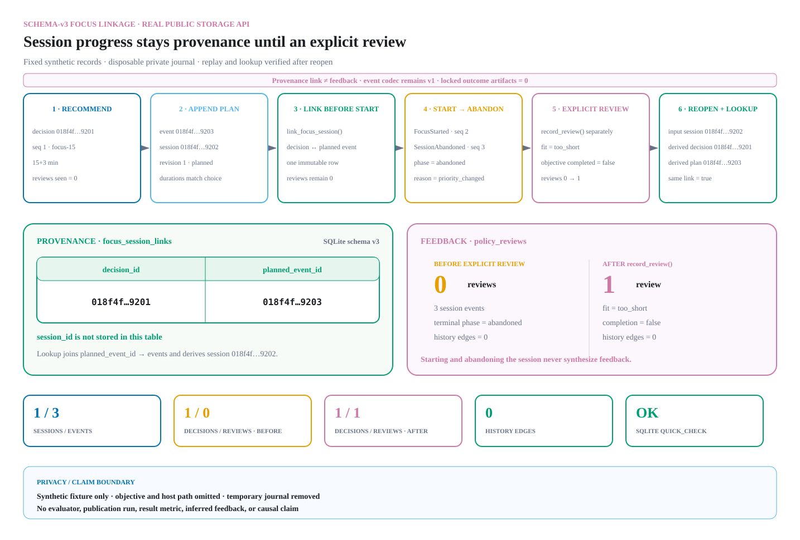

# Policy decision to focus-session linkage

> **Implementation status:** the schema-v3 table, exact v1/v2 migrations,
> immutable projection, mutation, lookup, bulk verification, and fail-closed
> tests are implemented. The domain event schema and canonical event codec
> remain version 1.

## Purpose and boundary

GWorker currently persists two independently valid histories in one private
journal:

- a `SessionPlanned` event begins an event-sourced focus session and contains
  the objective, chosen durations, and a policy identifier;
- a policy decision records the bounded context, selected template, exact
  propensity, and reviewed-decision history used for one recommendation.

A policy decision can be made without starting a session, and a session can be
planned without using the adaptive policy. That optionality must remain. When a
caller does use a durable recommendation to plan a session, schema version 3
records one explicit association between those records.

The link is provenance, not feedback. Creating it, starting or completing the
timer, measuring elapsed focus, abandoning the session, or reopening the
journal must not create a `policy_reviews` row or alter policy history. Only a
separate call with explicit closed review fields may do that.

The link is also not evidence of causality, productivity, or precise temporal
ordering. Policy decisions have a database sequence but no wall-clock
timestamp. The association records the caller's assertion that the selected
durable recommendation was used to construct that `SessionPlanned` record; the
store cannot prove that construction order independently.

## Version separation

Three versioned contracts must not be conflated:

1. **Domain event schema v1** defines `SessionPlanned` and the other immutable
   event variants.
2. **Canonical event codec v1** serializes those events. It must remain
   byte-compatible; no `decision_id` is added to the event payload.
3. **SQLite journal schema v3** adds the relational link outside the canonical
   event document.

Keeping the association in a table avoids rewriting historical event bytes,
duplicating a decision ID throughout domain projections, or forcing every
session source to create a policy decision.

## Relational record

Schema v3 adds exactly one table to the canonical v2 layout:

```sql
CREATE TABLE focus_session_links (
    decision_id TEXT PRIMARY KEY
        REFERENCES policy_decisions(decision_id)
        ON UPDATE RESTRICT
        ON DELETE RESTRICT,
    planned_event_id TEXT NOT NULL UNIQUE
        REFERENCES events(event_id)
        ON UPDATE RESTRICT
        ON DELETE RESTRICT
) WITHOUT ROWID
```

The database constraints enforce the parent records and the one-to-one shape:
one decision has at most one planned-event link, and one planned event has at
most one decision link. `session_id` is deliberately not duplicated; it is
derived from the referenced event. The reducer guarantees that a valid session
has exactly one sequence-1 `SessionPlanned`. Application validation supplies
the semantic checks that SQLite cannot express with these foreign keys,
including the event type, event sequence, canonical UUID spelling, and
agreement between the event and decision.

There is deliberately no objective, timestamp, review, propensity, task kind,
energy value, or duration copied into this table. Those values retain one
authoritative representation in their existing records.

## Required invariants

Every stored link must satisfy all of the following:

1. `decision_id` and `planned_event_id` are canonical, non-nil UUID strings.
2. `decision_id` resolves to exactly one `policy_decisions` row.
3. `planned_event_id` resolves to exactly one canonical `events` row whose
   `event_type` is `session_planned`.
4. The linked event is sequence 1, its decoded type is `SessionPlanned`, and
   its decoded identifiers agree with the `events` scalar columns. The event's
   `session_id` is the association's derived session identity.
5. Neither side already has a link. The primary key and unique constraint are
   necessary but do not replace the semantic replay checks.
6. The exact supplied `HierarchicalSoftmaxUCB` type and fingerprint match the
   stored decision and the `SessionPlanned.policy_id`.
7. Recomputing the stored decision from its seed, context, and ordered review
   history yields the stored template and exact propensity.
8. `SessionPlanned.target_focus_seconds` and
   `SessionPlanned.target_break_seconds` equal the recomputed selected
   template's durations.
9. At link time, replay of the target session is exactly `PLANNED` at revision
   1: only the `SessionPlanned` event exists.
10. The decision has no review when the link is created. A later explicit
    review is valid and does not modify the link.
11. A link is immutable. The public storage API exposes no update,
    reassignment, or delete operation.

Unlinked decisions and unlinked sessions are valid states, including all
records migrated from older journal versions. Verification must never infer a
link from matching policy IDs, template durations, insertion order, or nearby
timestamps. Linking after `FocusStarted`, any later event, or a review is
rejected so a caller cannot wait for an outcome and retrospectively select
which decision-session association to record.

## Link transaction

The implemented API exposes a narrow `link_focus_session()` mutation for a
durable decision and an already-persisted session that has not started:

1. Validate the exact policy object, decision UUID, and session UUID before
   opening a write transaction.
2. Open the permission-hardened journal and start `BEGIN IMMEDIATE`.
3. Require the exact canonical v3 schema and run the existing policy replay
   checks inside the transaction.
4. Require the decision to exist, belong to the supplied policy, be unreviewed,
   and be unlinked.
5. Recompute the durable recommendation from its stored context, seed, and
   exact ordered review history.
6. Load and replay the requested session in the same transaction. Require
   exactly one event: a canonical sequence-1 `SessionPlanned` whose projection
   is `PLANNED` at revision 1 and whose event ID is unlinked.
7. Require its policy ID and focus/break durations to match the recomputed
   recommendation and selected template.
8. Insert only `(decision_id, planned_event_id)` into
   `focus_session_links`, then commit once.

If validation, the insert, a foreign key, or the commit fails, the link insert
rolls back. The already persisted recommendation and session remain valid and
unlinked. A crash cannot expose a partial link row.

`BEGIN IMMEDIATE` gives concurrent callers the same behavior as current event
and policy mutations. Two callers attempting to consume one decision, one
session, or one planned-event ID cannot both succeed. A concurrent
`FocusStarted` append or explicit review serializes against the link: if it
commits first, linking fails; if the link commits first, the later ordinary
mutation may proceed without changing the link. Lock contention maps to the
existing stable conflict boundary; it must not leak SQL, objectives, paths, or
attacker-controlled arguments.

Generic `append(SessionPlanned)` remains the way to create both linked and
unlinked plans. Linkage neither changes event append nor adds a decision ID to
event-codec v1. No CLI command is part of this contract.

## Migration contract

All migration paths execute under the journal's permission, file-identity,
exact-schema, and transaction checks.

### New journal

Create the v1 event tables, v2 policy tables and indexes, and the v3 link table
inside one `BEGIN IMMEDIATE` transaction. Insert
`journal_metadata.schema_version = '3'`, validate the complete canonical
layout, and commit.

### Exact v2 to v3

1. Require metadata version `2` and the exact canonical v2 object names,
   columns, and SQL definitions.
2. Create `focus_session_links` with the exact v3 definition.
3. Update the metadata value to `3`.
4. Recheck all v3 columns, SQL definitions, foreign keys, and object names.
5. Commit once.

The new table starts empty. Existing event and policy rows are neither
rewritten nor interpreted as linked.

### Exact v1 to v3

1. Require metadata version `1` and exactly the v1 event tables.
2. In the same transaction, create the canonical v2 policy tables and indexes,
   then the v3 link table.
3. Update the metadata value directly to `3`, validate the complete v3 layout,
   and commit once.

The staged DDL may reuse internal v1-to-v2 and v2-to-v3 helpers, but version 2
must never become externally visible as a committed intermediate state.

Unknown versions, missing objects, extra objects, altered DDL, and hybrid
v1/v2/v3 layouts fail closed. Migration does not use `CREATE IF NOT EXISTS`,
does not guess which objects are trustworthy, and does not backfill links.
Any migration error rolls the whole transaction back to the original exact
layout and metadata value.

## Read and verification API

```python
@dataclass(frozen=True, slots=True)
class FocusSessionLink:
    decision_id: UUID
    decision_sequence: int
    session_id: UUID
    planned_event_id: UUID
    policy_id: str
    template_id: str


def link_focus_session(
    self,
    policy: HierarchicalSoftmaxUCB,
    decision_id: UUID,
    *,
    session_id: UUID,
) -> FocusSessionLink: ...


def focus_session_link(
    self,
    policy: HierarchicalSoftmaxUCB,
    *,
    session_id: UUID,
) -> FocusSessionLink | None: ...
```

The lookup derives `session_id` by joining the referenced planned event rather
than reading a duplicated link column. It returns validated decision identity
and selected-template metadata, not objective text or a caller-controlled path.
A caller that is already authorized to read the local journal may separately
replay the session. There is no generic update API and no CLI surface.

The existing `record_review()` remains the only durable learning mutation. A
future session-oriented UI may resolve `session_id` to `decision_id`, but it
must still ask for and submit explicit `DurationFit` and
`objective_completed` values. The linkage API must never synthesize those
fields from `FocusCompleted`, elapsed duration, interruption count, or
abandonment.

## Verification and failure model

Opening a journal first checks the exact v3 schema just as v2 does today.
Mutation and verification paths additionally validate link rows in bulk:

- `PRAGMA quick_check` and `PRAGMA foreign_key_check` must pass;
- every ID must be canonical and every parent row must exist;
- each target event must decode as the matching sequence-1 `SessionPlanned`;
- link, event, and decision policy IDs must agree;
- for the exact policy supplied to policy verification, recomputation must also
  prove the selected template and planned durations.

Structural damage, a foreign-policy mismatch in stored rows, an event-type or
identifier mismatch, and a recomputation mismatch are `CorruptJournal`
conditions. Missing caller-selected records, already-linked identifiers,
duration mismatch during linking, a reviewed decision, a session beyond
`PLANNED` revision 1, and concurrent uniqueness races are `JournalConflict`
conditions. Unsafe permissions or changed file identity remain
`JournalSecurityError` conditions. Unexpected SQLite operational failures
retain the existing path-private `JournalError` boundary.

Foreign keys and verification protect normal consistency and detect accidental
or unsophisticated mutation. They do not provide cryptographic authenticity
against a hostile process already running as the same Unix user, which can
rewrite the journal and its related rows.

## Privacy and joinability

The link table stores only identifiers, but it materially increases
joinability. A linked query can associate the policy's coarse context, choice,
propensity, and explicit review with the event stream's objective, UTC
timestamps, measured durations, interruptions, and abandonment reason. “No
objective in the policy table” therefore does not mean that linked policy data
is anonymous or harmless.

The v3 journal remains local, permission-hardened, ignored by Git, and
unencrypted by GWorker. Device or full-disk encryption remains the at-rest
protection. Link rows from user journals and joined user-data exports must never
enter committed demos, telemetry, the synthetic evaluator, publication
evidence, logs, or error messages. Any future export feature must make the join
explicit and require a separate privacy review.

## Implemented test coverage

Targeted, non-evaluation tests cover:

- byte-for-byte preservation of v1 codec fixtures and existing event rows;
- new-journal v3 creation plus exact v1-to-v3 and v2-to-v3 migrations;
- preservation of all old rows and an empty link table after migration;
- rollback on injected failures during both migration paths and after link
  insertion;
- rejection of unknown, hybrid, missing, extra, or altered schema objects;
- the exact two-column table shape and one-to-one uniqueness for decisions and
  planned-event IDs;
- missing parents, non-canonical UUIDs, wrong event type/sequence, mismatched
  scalar/event JSON, foreign policy, altered history, and duration mismatch;
- one successful link of an existing revision-1 plan, reopen, derived-session
  lookup, full replay, policy replay, and journal verification;
- rejection after `FocusStarted`, any later event, or an explicit review;
- link-versus-start, link-versus-review, duplicate-consumption, and competing
  writer races, with no partially visible link;
- proof that planning, starting, completing, abandoning, replaying, and
  verifying create no review and change no future policy history;
- an explicit linked review that preserves the recomputed template and exact
  propensity;
- linkage failures that do not echo the journal path, objective, or a fixed
  secret-like marker.

Tests use fixed synthetic UUIDs and objectives in private temporary journals.
They must not import or invoke the evaluator, publication runner, recorder, or
locked artifact workflow.

## Reproducible source-derived evidence



The committed diagram exercises the public storage API against a disposable
private journal and recomputes:

1. one durable recommendation;
2. one separately persisted `SessionPlanned` at revision 1;
3. one explicit link created before the focus starts;
4. a valid `FocusStarted` → `SessionAbandoned` stream with zero inferred
   reviews;
5. one separate explicit review;
6. successful reopen, session-derived lookup, and verification.

No linkage CLI exists, so this evidence is generated through the public storage
API rather than a staged terminal command. The SVG renders only recomputed
counts and stable truncated identifiers; it omits the synthetic objective and
host path. The source-visual manifest binds the implementation, documentation,
generator, and exact SVG bytes. Run:

```bash
PYTHONPATH=src python3 scripts/visuals/generate.py --check
```

The check regenerates the complete eight-diagram bundle in a temporary
directory and compares it byte-for-byte without invoking the evaluator,
publication runner, recorder, or terminal-capture workflow.
